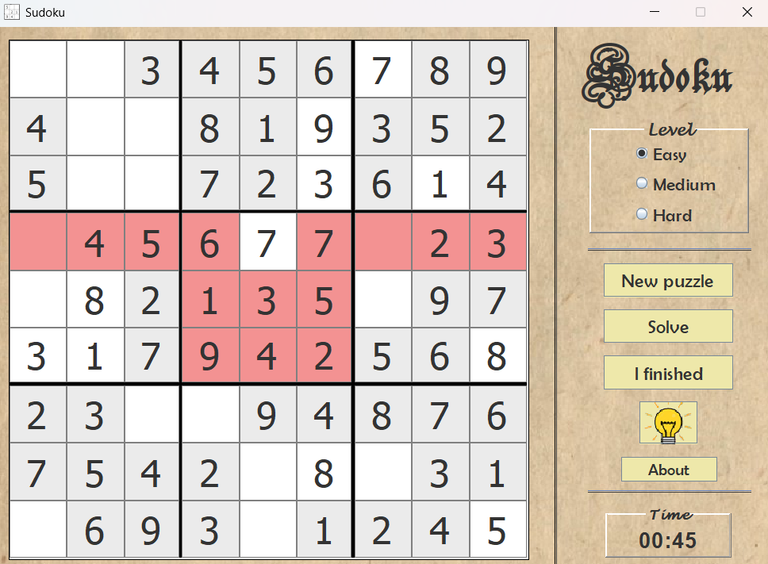

# KSudoku

A classic Sudoku desktop game built with pure Java Swing. Originally developed in 2014 by Khaled Kadri and later open-sourced on GitHub. It features three difficulty levels, real-time validation, and a backtracking-based solver.




## What it does

- **3 difficulty levels** — Easy/Medium/Hard just changes how many cells get removed from the solved grid (30/40/50).
- **Live validation** — type a conflicting number and the whole row, column and 3×3 block it clashes with turns red.
- **Auto-solver** — one button fills in the entire correct solution, backtracking under the hood.
- **Help mode** — toggle it on, then click any empty cell to peek at the right number.
- **Timer** — starts when the puzzle loads, shown in MM:SS, stops and shows your time when you finish.
- Numpad-first controls, retro parchment-style UI.

## How it's built

Two main classes, split cleanly between logic and UI:

```
frame.java  (Swing GUI, event handling)
     │
     ▼
 Jeu.java   (grid generation, validation, solving)
```

**Jeu.java** is where all the actual Sudoku logic lives. It builds a complete solved grid with backtracking (`estValide`: try a number, recurse into the next cell, undo and try the next number if that path fails), then produces the playable puzzle by blanking out cells depending on the chosen difficulty. It also exposes the row/column/block checks (`absentSurLigne`, `absentSurColonne`, `absentSurBloc`) that the UI calls on every keystroke to know whether what you just typed is legal.

**frame.java** owns the 9×9 grid of text fields and all the buttons (new puzzle, solve, help, "I'm done"). A `KeyListener` on each cell reads the digit you typed, asks `Jeu` if it's valid, and colors the cell (and any conflicting cells) red or white accordingly. A `FocusListener` handles help mode — when a cell gets focus and help is toggled on, it briefly shows the correct digit. Clicking "solve" just calls the backtracking solver and dumps the result straight into the grid.

**Chrono** is a small inner thread that ticks every 200ms and updates the timer label — nothing fancy, just a loop with a sleep.

Data flow on every keypress is basically: `keystroke → Jeu validates against rows/cols/blocks → frame recolors affected cells`. On completion, the same validation runs across all 81 cells at once, and if nothing comes back red you get the "solved in X:XX" dialog.

## Solver algorithm (backtracking)

```
estValide(grid, position) {
    if (position == 81) return true;  // All cells filled
    
    int i = position / 9;
    int j = position % 9;
    
    if (grid[i][j] != 0)
        return estValide(grid, position + 1);  // Skip filled
    
    for (int k = 1; k <= 9; k++) {
        if (isValid(k, i, j)) {
            grid[i][j] = k;
            if (estValide(grid, position + 1))
                return true;  // Found solution
        }
    }
    
    grid[i][j] = 0;  // Backtrack
    return false;
}
```

## Running it

```bash
cd KSudoku
javac src/*.java
java -cp src frame
```

Or just `java -jar KSudoku.jar` if you've got the compiled jar.

## Controls

| Key | Action |
|---|---|
| 1–9 / Numpad | Enter a number |
| Delete / Backspace | Clear the cell |
| Tab | Next cell |

## Known limitations

No save/resume, no puzzle-uniqueness guarantee (it's statistically very likely but not mathematically proven per puzzle), and difficulty is just "how many cells are hidden" rather than a real solving-technique rating. All fair game for a PR if you want to take a crack at any of it.

## License

MIT — see [LICENSE](LICENSE).
